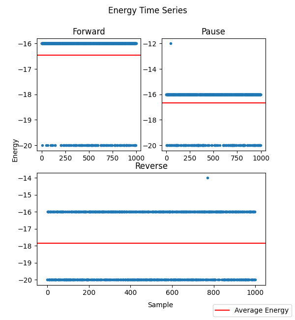

[](
  https://circleci.com/gh/dwave-examples/reverse-annealing-notebook)

# Reverse Anneal

This notebook explains and demonstrates the reverse-anneal feature.

Reverse annealing is a technique that makes it possible to refine known good local
solutions, thereby increasing performance for certain applications. It comprises
(1) annealing backward from a known classical state to a mid-anneal state of
quantum superposition, (2) searching for optimum solutions at this mid-anneal
point while in the presence of an increased transverse field (quantum state), and
then (3) proceeding forward to a new classical state at the end of the anneal.

The notebook has the following sections:

1. **The Reverse Anneal Feature** explains the feature and its parameters.
2. **Using the Reverse Anneal Feature** demonstrates the use of the feature on a
   random example problem.
3. **Analysis on a 16-Bit Problem** uses reverse annealing on a known problem and
   compares the results with other anneal methods.
4. **Modulating the Reverse-Annealing Parameters** provides code that lets you
   sweep through various anneal schedules to explore the effect on results.



## Installation

You can run this example without installation in cloud-based IDEs that support 
the [Development Containers specification](https://containers.dev/supporting)
(aka "devcontainers").

For development environments that do not support ``devcontainers``, install 
requirements:

    pip install -r requirements.txt

If you are cloning the repo to your local system, working in a 
[virtual environment](https://docs.python.org/3/library/venv.html) is 
recommended.

## Usage

Your development environment should be configured to 
[access Leap’s Solvers](https://docs.ocean.dwavesys.com/en/stable/overview/sapi.html).
You can see information about supported IDEs and authorizing access to your 
Leap account [here](https://docs.dwavesys.com/docs/latest/doc_leap_dev_env.html).  

The notebook can be opened by clicking on the 
``01-reverse-annealing.ipynb`` file in VS Code-based IDEs. 

To run a locally installed notebook:

```bash
jupyter notebook
```

## License

See [LICENSE](LICENSE.md) file.
